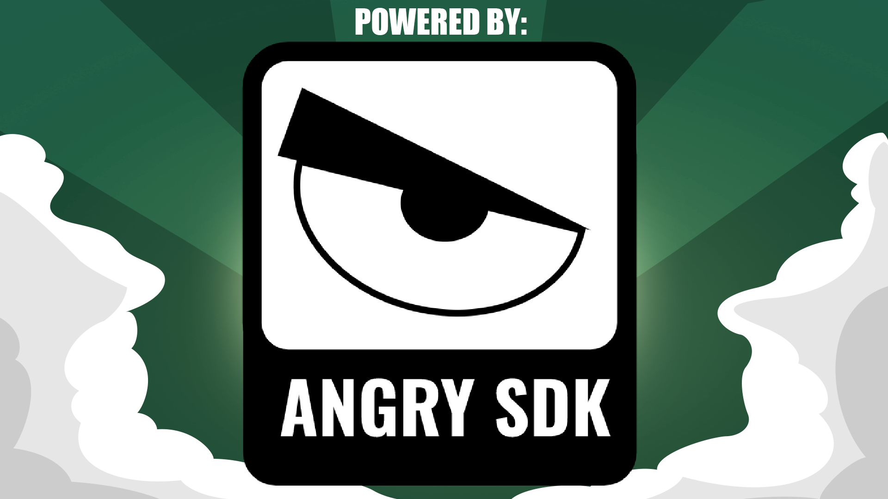

# Angry Software Development Kit

An extensive Angry Birds Mod to make the game more accessible to developers!

---
## Downloads
To download AngrySDK you'll need a copy of Angry Birds Seasons 3.3.0, simply replace the game's data folder and config.lua file with the ones presented here to get started.
## Features
- Special blocks
- Grid snap
- Score ui style
- Theme "filters" 
---
# Links
- Join the [Hidden Birds Discord](https://discord.gg/Bz24PBHxDE) for most things listed below!
## Tool Dependencies
- Visual Studio Code
- [LevelAutoEnc](https://github.com/GZHYBFHHJ/LevelAutoEnc/releases/)
- [AB Studio](https://github.com/giroletm/ABStudio/releases/tag/v0.1.1-Hotfix1)
- Angry.exe
- LuaCPlus
---
# Footnotes
AngrySDK is (C) 2024 Hidden Birds.

This is provided as a free modification for Angry Birds Seasons 3.3.0, you may redistribute or modify it how you like with credit included to the original authors and software.

AngrySDK and Hidden Birds are unaffiliated with Rovio Entertainment Oyj or their products, regardless of this being a modification for their game's source.
Additionally, this is not intended as a replacement for Angry Birds or any other program.
